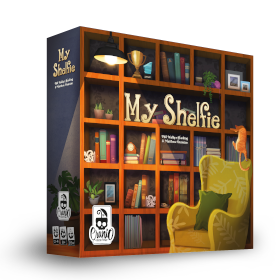

# MyShelfie - IS23AM10
| [](https://github.com/mattteochen/IS23-AM10/actions) |  |
| --- | --- |


## The project
This Java project is a porting of the boardgame *MyShelfie* by [Cranio Creations](https://www.craniocreations.it/prodotto/my-shelfie). It was realized as final project of the *Software Engineering* course at [Politecnico di Milano](https://www.polimi.it). 

### The team
**Group 10 (Prof. Alessandro Margara)**
- Alessandro Amandonico (@aleama01)
- Francesco Buccoliero (@frbuccoliero)
- Kaixi Matteo Chen (@mattteochen)
- Lorenzo Cavallero (@locavallero)

---

## Status of the work
| Functionality | Status | 
| --- | --- |
| Basic rules | :white_check_mark: |
| Complete rules | :white_check_mark: |
| Socket connection | :white_check_mark: |
| RMI connection | :white_check_mark: |
| CLI | :construction: |
| GUI | :ballot_box_with_check: |
| Multiple games | :white_check_mark: |
| Persistence | :x: |
| Resilience | :construction: |
| Chat | :white_check_mark: |

**Legend**
| Symbol | Functionality status |
| --- | --- |
| :white_check_mark: | Completed |
| :ballot_box_with_check: | Planned, not started yet | 
| :construction: | Work in progress |
| :x: | Not planned to be implemented |

---

## How to Play



Run the app with the following command line arguments:

- `--is-server` to launch the app in server mode. (Default: `false`)
- `--show-gui` to launch the client in GUI mode. If false launches the client in CLI mode. (Default: `false`) 🔶
- `--use-rmi` to launch the client using RMI connection over Socket. (Default: `false`) 🔶
- `--debug` to get verbose output in Client mode. Server mode always has verbose logging. (Default: `false`) 🔶
- `--address [ipv4]` the address where client should look for a server. (Default: `localhost`) 🔶
- `--socket-port [1024-65535]` the port where server should expose the socket/client should connect to. (Default: `9001`)
- `--rmi-port [1024-65535]` the port where server should expose the rmi registry/client should retrieve the stub. (Default: `9002`)
- `--max-connections [0-10]` the maximum number of clients who can connect to the server. (Default: `8`) 🔷
- `--keep-alive [bool]` to set socket keepalive function. (Default: `true`) 🔷

🔶 = Command only works in client mode. Will be ignored if launched in server mode.

🔷 = Command only works in server mode. Will be ignored if launched in client mode.

---

## Development
Project works fine as a stand-alone Maven project. Can be opened in any IDE, but a Docker container with ready-to-code extensions is also provided. If you want to use it follow these instructions:

- Open the project with VSCode Developer Docker [Container](https://code.visualstudio.com/docs/devcontainers/containers), hence build the container (for MacOS users `cmd+shift+p` and type "Build Container").
- There are two options to run tests:
  - Use `Java Test Runner` extension: Enable Junit testing with `Java Test Runner` extension that you will find in the tool bar, it will ask you to choose the version to download, select `JUnit Jupiter`.
  - Use Maven test runner embedded in the available plugin.

### Code format
Red Hat auto code formatter is available. Please run `cmd+shift+p` + `Format document with` and select `Red Hat` option before committing.
Universal code format is required to maintain an unique format style.

You can also enable live format compliance check with the `Checkstyle` [extension](https://marketplace.visualstudio.com/items?itemName=shengchen.vscode-checkstyle).
Configuration:
- `cmd+shift+p` + `Set the Checkstyle Version` -> select `built-in`
- `cmd+shift+p` + `Set the Checkstyle Configuration File` -> select `Google's Style`
`Checkstyle` should live check you code format.

### Live bug checks
Sonar lint extensions is available (auto enabled) to detect [issues](https://marketplace.visualstudio.com/items?itemName=SonarSource.sonarlint-vscode) during the development.
Please follow all the best practices.

### Generate Jacoco test coverage report
To generate test coverage report launch JaCoCo with the following command from `<REPOSITORY_DIRECTORY>/is23am10`:
```
mvn clean jacoco:prepare-agent install jacoco:report
```
or use the button under "Favorites" in your Maven left-side panel if you use the VSCode dev container.

### Generate Javadoc 

Use the command `mvn javadoc:javadoc` to generate the HTML. You'll find the artifact in `target/site/apidocs`.

## Legal

The name "My Shelfie", all related graphics and the rights associated are propriety of Cranio Creations S.r.l.

The software is released under MIT License, see [LICENSE](LICENSE). 